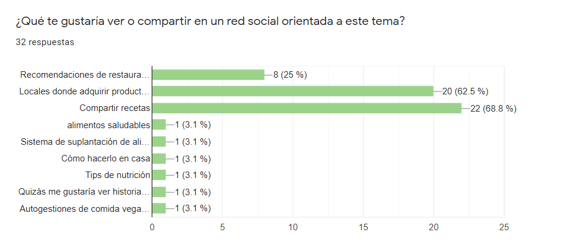
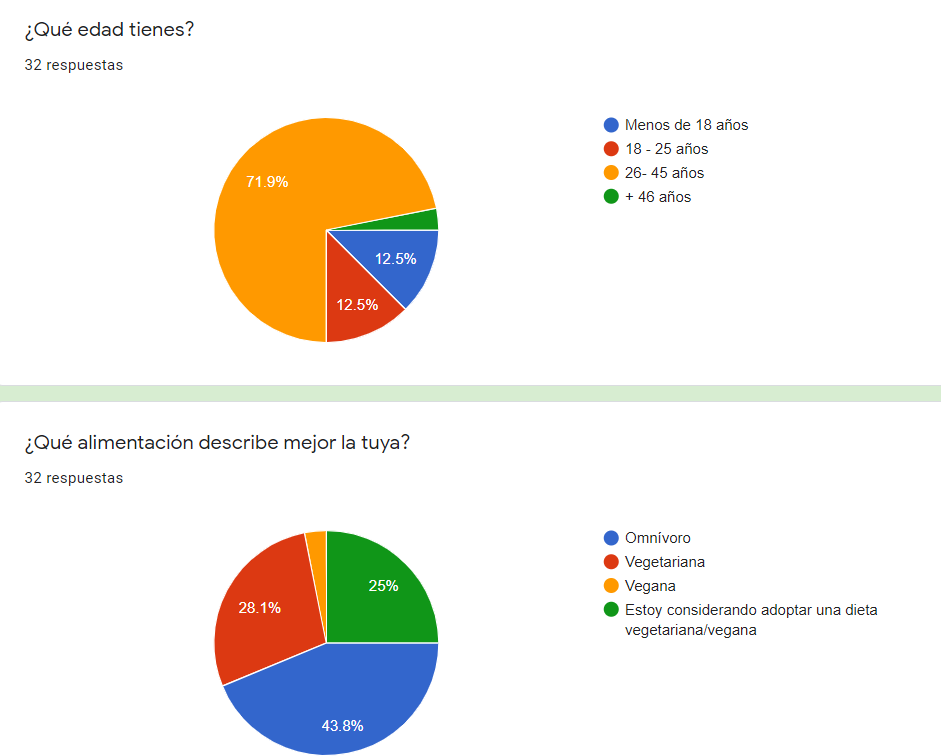
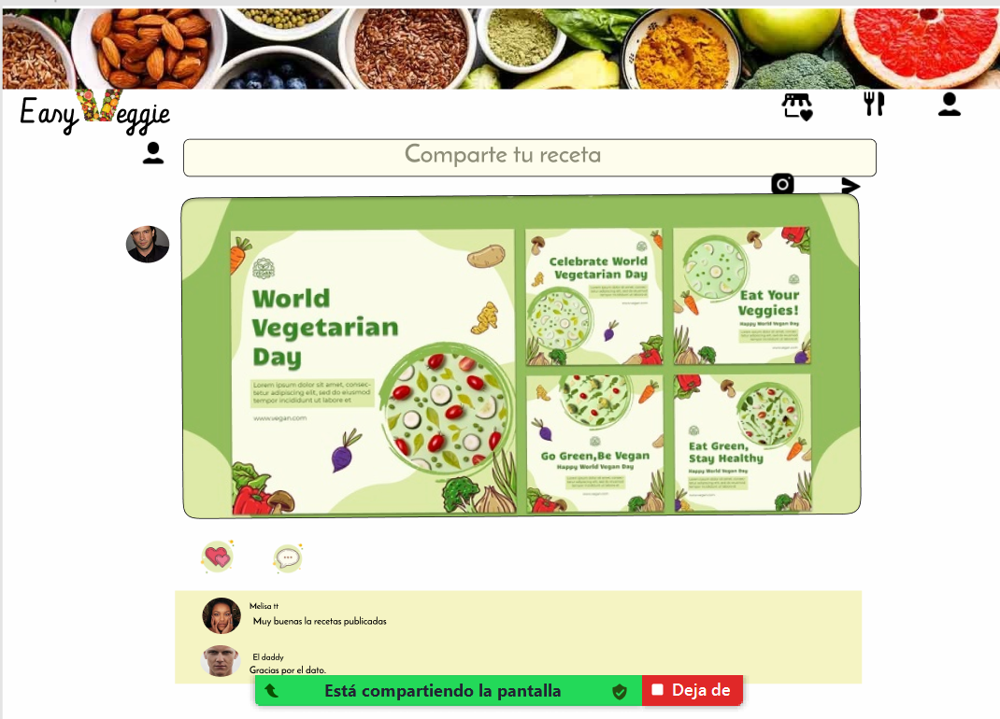

# Easy Veggie
## Índice

* [Definicion del producto](#Definicion-de-producto)
* [Encuesta](#Encuesta)
* [Historias de usuario](#Historias-de-usuario)
* [Prototipo](#Prototipo)
* [Testeos de usabilidad](#Testeos-de-usabilidad)
* [Enlace](#enlace)
***

## Definicion del producto

Easy Veggie es una red social enfoncada en personas vegetarianas entre un rango etario desde los 18 hasta los 55 años, que están en busca de recetas fáciles, ricas y/o saludables, compartidas por personas con similares necesidades.

El objetivo de esta red social es facilitar el acceso a recetas libres de animales, a personas comunes y corrientes, lo que servirá para hacer más accesible su estilo de alimentación, creando a la vez un sentido de pertenencia.

Luego de establecer en grupo las funcionalidades que tendría el sitio, se crearon las historias de usuario a traves de una escuesta(que mostraremos a continuacion) las cuales determinan el flujo de trabajo.

https://docs.google.com/forms/d/1jf65DNmP90deaTD3AEvrp3cFyZ7povTVCLHCdPtryGE/edit

## Encuesta

## Historias de Usuario

A continuación detallaremos 3 historias de usuarios que elegimos para la construcción de nuestra página:

HU1 : Como usuario me gustaría que la pagina fuera amigable como Instagram que permita registrarme con una cuenta o acceder desde Google.

HU2: Como persona que lleva una alimentación vegetariana, me gustaría ver o compartir recetas.

HU3: Como persona que esta pensando optar por una alimentación vegetariana, me gustaría acceder a información sobre si se necesita suplementación con alguna vitamina, tips de lugares de venta baratos.

## Prototipo

 ## Testeos de Usabilidad
 Se realizaron entrevistas personales a 3 personas para probar la usabilidad de la pagina y se llegó a la conclusión de que era necesario modificar algunos elementos para mejorar las experiencia del usuario. En base a este,decidimos hacer los siguientes cambios en nuestra página:

 - Se modifico la imagen de fondo.
 - Dar el mismo tamaño a formulario de ingreso y registro.
 - Crear un cuadro lateral que contiene los items de muro,perfil y cierre de sesión.
 - Agregar cursor pointer y hover a los botones.
 - Crear una barra lateral que contiene links de recomendaciones de paginas orientadas al mundo vegetariano(donde   encontrar productos, recetas de fácil preparación, direcciones de restaurantes, etc)

 ## Enlace página🚀
 https://easy-veggie-scl018.web.app

 ## 🛠️ Creado por:

 ### Mabel Rengifo - Alejandra Maureira
